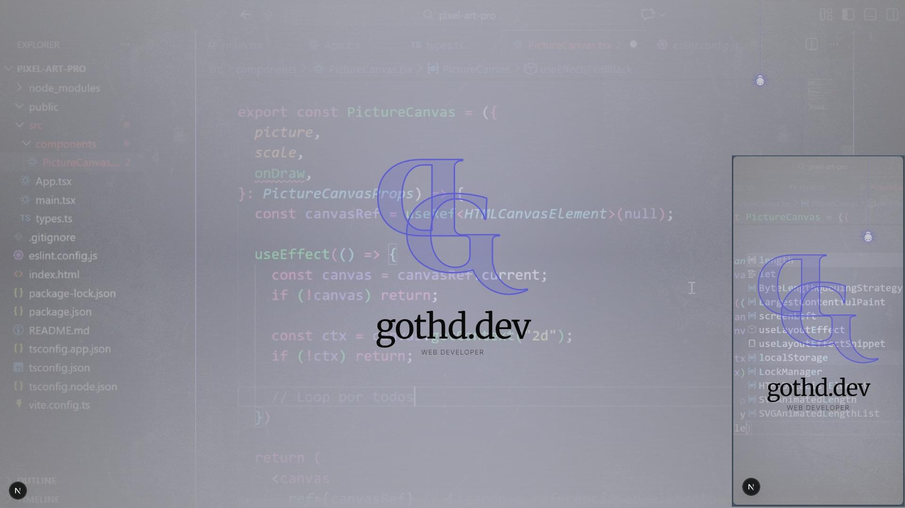

# Gothd - Digital Atelier Portfolio Template



> Template de portfólio focado em micro-interações, animações SVG e estética dark minimalista. Explora a interseção entre código e arte com **Next.js 16**, **Tailwind CSS v4** e **next-intl**.

## ✨ Recursos

- **Stack Moderna:** Next.js 16 (App Router), Tailwind v4 (CSS-first config), TypeScript.
- **Internacionalização (i18n):** Suporte nativo a PT-BR e EN via `next-intl`, com roteamento e SEO dinâmico.
- **Dark Mode Interativo:** Toggle de tema único (`SpiderWireframe`) com física via Framer Motion.
- **Performance Visual:** Background de vídeo otimizado (LCP) com overlay adaptativo e ruído.
- **Animações:** Desenho de caminho SVG e header "scroll-aware".

## 🛠️ Tecnologias

- [Next.js 16](https://nextjs.org/)
- [Tailwind CSS v4](https://tailwindcss.com/)
- [Framer Motion](https://www.framer.com/motion/)
- [next-intl](https://next-intl.dev/)
- [next-themes](https://github.com/pacocoursey/next-themes)

## 🚀 Rodando Localmente

```bash
git clone [https://github.com/gothd/portfolio.git](https://github.com/gothd/portfolio.git)
cd portfolio
npm install # ou pnpm/yarn
npm run dev
```

Acesse `http://localhost:3000`.

## 🎨 Personalização Rápida

### Cores e Fontes

Edite as variáveis CSS nativas em `app/globals.css`:

```css
@theme {
  --color-obsidian: #0a0a0a; /* Fundo Dark */
  --color-accent: #d4d4d8; /* Cor de destaque */
  --font-serif: "Merriweather", serif;
}
```

### Textos e Traduções

Edite os arquivos JSON em `messages/`:

- `pt-BR.json`: Textos em Português.
- `en.json`: Textos em Inglês.

### Assets (Logo e Vídeo)

- **Logo SVG:** Substitua os paths `pathD` e `pathG` em `components/Hero.tsx`.
- **Vídeo:** Substitua `hero-bg.webm/mp4` e `video-poster.jpg` na pasta `/public`.

## 📂 Estrutura Principal

```
├── app/[locale]/       # Rotas internacionalizadas
│   ├── layout.tsx      # Layout principal com i18n e ThemeProvider
│   └── page.tsx        # Página Home
├── components/         # Componentes React (Hero, Header, Spider, etc.)
├── messages/           # Arquivos de tradução (pt-BR.json, en.json)
├── public/             # Assets estáticos
├── src/                # Configurações de i18n e navegação
└── proxy.ts            # Middleware do Next.js (roteamento i18n)
```

## 📄 Licença

Este projeto está licenciado sob a licença MIT.

---

Feito com 🖤 por Ruan Oliveira Sena
